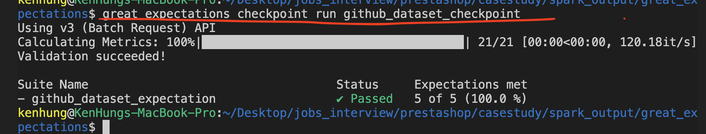

# How to run this in your own local
# Please follow below steps to run the casestudy in your own environment

##  __In your google account (bigquery)__
1. create a dataset in your own node (ex: github)
2. copy the table (sample_commits , languages) you need into the dataset that just created 
3. download you account source key file (json file) and place in the path ./pyspark-docker-stack

##  __Build the docker image__

1. Change your own parameter in the dockerfile
    - Your own google account source api key file:
        ```sh
        ENV GOOGLE_API_KEY=khung-playground-cb7110dd8c95.json
        ```
    - Select the language table you like to analyze in your bigquery
         ```sh
        ENV TABLE_LANGUAGE="khung-playground.github.languages"
        ```
    - Select the commit table you like to analyze in your bigquery
        ```sh
        ENV TABLE_COMMIT="khung-playground.github.commits"
        ```
    - Select one language you like to analyze
         ```sh
        ENV ENV LANGUAGE="Python"
        ```
    - Select your google account project name
         ```sh
        ENV PARENT_PROJECT="khung-playground"
        ```
2.  Build the dockerfile in your local (This step take 10 ~ 15 mins)
    ```sh
    cd <project_root_path>/pyspark-docker-stack
    docker build -t pyspark:khung . 
    ```
    
3. Run the docker images with some files mounted (the scripts, notebook and output file)
    ```sh
    cd <project_root_path>
    docker run -it --rm -p 8888:8888 -v "${PWD}/notebooks":/home/jovyan/work \
                                     -v "${PWD}/spark_output":/home/jovyan/spark_output \
                                     -v "${PWD}/scripts":/home/jovyan/scripts \
                                    pyspark:khung
    ```


## __To run the spark script and review unit test result__

1. I left the notebook file to showcase my logic of transforming data in both pysaprk & sparkSQL need to open the browser after the container is running
2. To run the whole process as spark script:
    ```sh
    docker exec -it container_id /bin/bash
    cd ~/scripts
    spark-submit --jars "../spark-bigquery-latest_2.12.jar" run.py
    ```
3. To run the unit test on the function
      ```sh
      docker exec -it container_id /bin/bash
      cd ~/scripts/tests
      pytest test_utils
      ```

## __To validate the data quility__
#### !!! This only run in your local instead of container !!!
#### prerequisite
- Download the great_expectations cli is the must (https://docs.greatexpectations.io/docs/guides/setup/installation/local)
- Need to change your datasource base path to your own
    - In <project_root_path>/spark_output/great_expectations/great_expectations.yml
    ```sh
      base_directory: <change the path to your own>
    ```
- Run the great expectation
  ```sh
  cd <project_root_path>/spark_output/great_expectations
  greate_expectations checkout run github_dataset_checkpoint
  ```
 
 #### I left both "clean" & "dirty" data in the <project_root_path>/spark_output
- if run validation on cleaned data will be like

- if run validation on dirty data will be like

